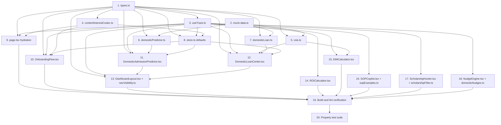

# Implementation Plan: Domestic Track MVP

## Overview

Convert the Domestic Track MVP design into a series of incremental coding tasks, ordered as a wave-based DAG. Pure logic and types come first (Waves 1–2), then the persistence boundary (Waves 3–4), then page wiring and net-new pages (Waves 5–6), then existing-page tweaks and the nudge engine (Wave 7), and finally end-to-end verification (Wave 8). Tasks within the same wave have no inter-dependencies and can be dispatched in parallel by the orchestrator.

Hard constraints carried into every task:

- Workspace `AGENTS.md` says "This is NOT the Next.js you know — read `node_modules/next/dist/docs/` before writing Next.js code." Any task that touches App Router files, dynamic APIs, `params`/`searchParams`/`cookies`/`headers`, `'use server'`, `'use cache'`, or route handlers MUST include a sub-step "Read relevant guide in `node_modules/next/dist/docs/` before coding."
- Do NOT modify `src/components/pages/AdmissionPredictor.tsx`, `src/components/pages/LoanCenter.tsx`, `src/components/pages/VisaSimulator.tsx`, or `src/components/pages/CurrencyRisk.tsx`. The new domestic predictor and loan center MUST be added as new files at `src/components/pages/DomesticAdmissionPredictor.tsx` and `src/components/pages/DomesticLoanCenter.tsx`.
- The `useTrack` hook MUST live at `src/lib/useTrack.ts`.
- No Supabase migration. Reuse the existing `content_interest jsonb` column via `src/lib/contentInterestCodec.ts` (legacy `string[]` decode + new `{v:2, tags, domesticMeta}` encode). The codec MUST exist before any consumer.
- Theme: only `var(--*)` tokens and existing utility classes (`card`, `glass`, `btn-primary`, `btn-secondary`, `input-field`, `stat-card`, `progress-bar`, `badge`, etc). No hex literals in NEW files.
- Property-based tests live under `tests/properties/domestic-track-*.test.ts`. Each test file's header comment MUST be tagged `Feature: domestic-track-mvp, Property N: <title>`. Each property test runs with at least 100 iterations.
- Every implementation task with a corresponding property in `design.md` MUST include the property test as a sub-task and reference the property number.

## Tasks

### Wave 1 — Pure types and mock data (parallel; no cross-deps)

- [x] 1. Add domestic-track types to `src/lib/types.ts`
  - Add `Track = 'abroad' | 'domestic' | 'both'`.
  - Add `ReservationCategory = 'GENERAL' | 'EWS' | 'OBC_NCL' | 'SC' | 'ST' | 'PWD'`.
  - Add `ExamType = 'JEE_Advanced' | 'GATE' | 'CAT' | 'OTHER'`.
  - Add `ReachMatchSafetyBucket = 'Reach' | 'Match' | 'Safety' | 'Out_Of_Range'`.
  - Add `DomesticUniversity` interface with `id`, `name`, `examType: ExamType`, `seatMatrix: Partial<Record<ReservationCategory, number>>`, `closingRanks: Partial<Record<ReservationCategory, number>>` (or closing percentile for CAT), `isNotifiedForCSIS: boolean`, `tuitionINR`, plus any descriptive metadata used by the predictor card.
  - Add `DomesticLoanProduct`, `DomesticLoanCriteria` (the criteria DSL described in the design), and `LoanEligibility = 'Eligible' | 'Not_Eligible' | 'Conditionally_Eligible'`.
  - Add `IndianScholarship` (extends or mirrors existing scholarship shape with `currency: 'INR'` and `country: 'IN'`).
  - Extend `StudentProfile` with the new domestic-track fields enumerated in design Section "Data Model": `studyGoal` already present (confirm), `reservationCategory?`, `jeeAdvancedRank?`, `gateRank?`, `gateScoreYear?`, `gateDiscipline?`, `catPercentile?`, `familyAnnualIncomeINR?`, `targetInstituteId?`, `domesticExamScoreMissing?: boolean`.
  - Extend the `PageType` union to include `'domestic-admission-predictor'` and `'domestic-loan-center'`.
  - _Validates: Req 1, 2, 4, 5, 11, 16_

- [x] 2. Add domestic-track mock data to `src/lib/mock-data.ts`
  - Add `domesticUniversities: DomesticUniversity[]` with at least 30 and at most 40 records. Cover a mix of `examType` values across `JEE_Advanced`, `GATE`, and `CAT`. Each record MUST include `seatMatrix` and `closingRanks` keyed by `ReservationCategory`, an `isNotifiedForCSIS: boolean`, and a non-zero `tuitionINR`.
  - Add `premierInstituteList: string[]` containing the institute ids that count as "premier" for loan products that gate on it.
  - Add `indianScholarships: IndianScholarship[]` with 8–10 records, every record `currency: 'INR'`.
  - Do not modify any existing exports; only add new exports.
  - _Validates: Req 2, 11_

### Wave 2 — Pure libs (parallel; depend on T1, some on T2)

- [x] 3. Create `src/lib/useTrack.ts`
  - Export `deriveTrack(studyGoal: StudentProfile['studyGoal']): Track` mapping `'abroad' → 'abroad'`, `'india' → 'domestic'`, `'both' → 'both'`, and any other / undefined → `'abroad'` (default).
  - Export `useTrack(): Track` as a thin Zustand selector hook on top of the existing store (no extra state, just `deriveTrack(profile.studyGoal)`).
  - [x] 3.1 Write Property 1 (deriveTrack totality) at `tests/properties/domestic-track-derive.test.ts`
    - Header comment: `// Feature: domestic-track-mvp, Property 1: deriveTrack totality`.
    - Run with at least 100 iterations of `fast-check`.
    - For any input value drawn from the `studyGoal` domain (including malformed strings and `undefined`), `deriveTrack` returns one of `'abroad' | 'domestic' | 'both'` and never throws.
  - _Validates: Req 1, Property 1_

- [x] 4. Create `src/lib/contentInterestCodec.ts` (depends on T1)
  - Define `ContentInterestPayload` matching the design: `{ v: 2; tags: string[]; domesticMeta: { reservationCategory?: ReservationCategory; jeeAdvancedRank?: number; gateRank?: number; gateScoreYear?: number; gateDiscipline?: string; catPercentile?: number; familyAnnualIncomeINR?: number; targetInstituteId?: string } }`.
  - Implement `decodeContentInterest(raw: unknown): ContentInterestPayload` that:
    - Returns the new payload shape unchanged when `raw` is already `{v: 2, ...}`.
    - Decodes legacy `string[]` into `{ v: 2, tags: raw, domesticMeta: {} }`.
    - Decodes `null`/`undefined`/anything else into `{ v: 2, tags: [], domesticMeta: {} }`.
  - Implement `encodeContentInterest(payload: ContentInterestPayload): unknown` that strips undefined fields from `domesticMeta` and always emits `{ v: 2, tags, domesticMeta }`.
  - [x] 4.1 Add Vitest + fast-check as devDependencies and wire test scripts
    - Run `npm install --save-dev vitest fast-check @vitest/ui` (use exact pinned versions).
    - Add `"test": "vitest"` and `"test:run": "vitest run"` to `package.json` scripts. Do not change existing scripts.
    - Add a minimal `vitest.config.ts` at the project root that includes `tests/**/*.test.ts`.
    - Read `node_modules/next/dist/docs/` for any guidance on test file colocation before placing the config (Next.js project structure may differ from defaults).
  - [x] 4.2 Write Property 6 (codec round-trip) at `tests/properties/domestic-track-codec-roundtrip.test.ts`
    - Header comment: `// Feature: domestic-track-mvp, Property 6: contentInterest codec round-trip`.
    - At least 100 iterations.
    - For any `ContentInterestPayload`, `decodeContentInterest(encodeContentInterest(p))` produces a payload equivalent to `p` (after stripping undefineds).
    - For any legacy `string[]`, `decodeContentInterest(legacy)` yields `{ v: 2, tags: legacy, domesticMeta: {} }` and re-encoding then decoding is idempotent.
  - _Validates: Req 14, Property 6_

- [x] 5. Create `src/lib/csis.ts` (depends on T1, T2)
  - Implement `computeCsisEligible(profile: StudentProfile, university: DomesticUniversity | undefined): boolean` per the design (notified institute AND family income ≤ ₹4.5 LPA AND domestic admission context).
  - Implement `computeCsisSavings({ principalINR, annualRatePct, tenureYears, eligible }): { totalInterestSavedINR: number; monthlyDeltaINR: number }` using simple-interest moratorium subsidy as defined in the design. Return zeros when `eligible === false`.
  - Implement and export `effectiveEmi({ principalINR, annualRatePct, tenureYears, csisOn })` used by the EMI calculator delta (placed here for colocation; see T15).
  - [x] 5.1 Write Property 4 (CSIS eligibility AND) at `tests/properties/domestic-track-csis-eligibility.test.ts`
    - Header comment: `// Feature: domestic-track-mvp, Property 4: CSIS eligibility is conjunction of all gates`.
    - At least 100 iterations.
    - For any profile + university, `computeCsisEligible` returns `true` if and only if every gate (notified institute, income ≤ threshold, domestic context) is satisfied. Flipping any single gate to false flips the result to false.
  - [x] 5.2 Write Property 5 (CSIS savings monotonicity + zero on ineligible) at `tests/properties/domestic-track-csis-savings.test.ts`
    - Header comment: `// Feature: domestic-track-mvp, Property 5: CSIS savings monotone in principal and zero when ineligible`.
    - At least 100 iterations.
    - When `eligible === false`, both savings outputs are exactly zero.
    - When `eligible === true`, both outputs are non-decreasing in `principalINR` (holding rate and tenure constant).
  - _Validates: Req 6, Properties 4 and 5_

- [x] 6. Create `src/lib/domesticPredictor.ts` (depends on T1, T2)
  - Implement `bucketByRank(rank: number, closing: number): ReachMatchSafetyBucket` and `bucketByPercentile(percentile: number, closingPercentile: number): ReachMatchSafetyBucket` using the thresholds defined in the design.
  - Implement `classifyRecord(profile: StudentProfile, uni: DomesticUniversity): ReachMatchSafetyBucket` that selects the score axis from `uni.examType` and the relevant profile field, picks `closingRanks[reservationCategory]` (falling back to `GENERAL` when missing), and returns `'Out_Of_Range'` if the relevant score is missing.
  - Implement `classifyDataset(profile: StudentProfile, dataset: DomesticUniversity[]): Record<ReachMatchSafetyBucket, DomesticUniversity[]>`.
  - [x] 6.1 Write Property 2 (predictor monotonicity) at `tests/properties/domestic-track-predictor-monotone.test.ts`
    - Header comment: `// Feature: domestic-track-mvp, Property 2: classifyRecord is monotone in rank/percentile`.
    - At least 100 iterations.
    - For any university, improving the candidate's rank (lower is better for ranks; higher is better for percentile) never moves the bucket toward a worse classification (`Safety > Match > Reach > Out_Of_Range`).
  - [x] 6.2 Write Property 3 (partition completeness) at `tests/properties/domestic-track-predictor-partition.test.ts`
    - Header comment: `// Feature: domestic-track-mvp, Property 3: classifyDataset partitions input set`.
    - At least 100 iterations.
    - For any profile and dataset, the union of all four returned buckets equals the input dataset (multiset equality), and the buckets are pairwise disjoint.
  - _Validates: Req 4, Properties 2 and 3_

- [x] 7. Create `src/lib/domesticLoan.ts` (depends on T1, T2)
  - Define `domesticLoanProducts: DomesticLoanProduct[]` containing the seven products from the design. Each product has its `criteria: DomesticLoanCriteria` and a human-facing description.
  - Implement `parseFamilyIncome(value: string | number | undefined): number | undefined` that tolerates leading currency markers and `LPA` suffixes used in the onboarding inputs.
  - Implement `evaluateLoanProduct(profile: StudentProfile, product: DomesticLoanProduct): { status: LoanEligibility; matched: string[]; unmatched: string[]; missing: string[] }` exactly as specified in the design (any unmatched ⇒ `Not_Eligible`; no unmatched but at least one missing ⇒ `Conditionally_Eligible`; otherwise `Eligible`).
  - [x] 7.1 Write Property 7 (loan tri-state) at `tests/properties/domestic-track-loan-eligibility.test.ts`
    - Header comment: `// Feature: domestic-track-mvp, Property 7: loan eligibility tri-state derivation`.
    - At least 100 iterations.
    - For any profile and product, exactly one of the three statuses is returned. `unmatched.length > 0` implies `Not_Eligible`. `unmatched.length === 0 && missing.length > 0` implies `Conditionally_Eligible`. `unmatched.length === 0 && missing.length === 0` implies `Eligible`.
  - _Validates: Req 5, Property 7_

### Wave 3 — Persistence boundary (depends on T1, T3, T4)

- [x] 8. Update `src/lib/store.ts` to register domestic-track defaults
  - Extend `defaultProfile` to include the new domestic-track fields with safe defaults (`undefined` for optional fields, `false` for `domesticExamScoreMissing`).
  - Confirm that `partialize` already covers `profile` so the additions are persisted automatically. Do not modify `partialize` if it already serializes the full profile object.
  - Smoke-check by booting the app locally (manual, no automated test) and verifying via Zustand devtools that the new keys appear under `profile`.
  - _Validates: Req 14_

- [x] 9. Update `src/app/page.tsx` hydration path
  - [x] 9.1 Read `node_modules/next/dist/docs/` App Router data-fetching and Server Component guides before editing this Next.js file.
  - On profile fetch from Supabase, call `decodeContentInterest(row.content_interest)` and dispatch the resulting `tags` plus every key in `domesticMeta` onto the Zustand store via `updateProfile`. Preserve existing behavior for users whose `content_interest` is still a legacy `string[]`.
  - Do not introduce new dynamic API usage (`params`, `cookies`, `headers`) unless the existing file already uses them; if it does, follow the relevant doc.
  - _Validates: Req 14_

### Wave 4 — Onboarding (depends on T1, T3, T4, T8)

- [x] 10. Update `src/components/OnboardingFlow.tsx`
  - Conditionally render the Indian-exam input fields in Step 5 based on `useTrack()`, exactly per design Section "Onboarding Step 5 Changes" (JEE Advanced rank, GATE rank/year/discipline, CAT percentile, reservation category, family annual income).
  - On submit of Step 5, compute and persist `domesticExamScoreMissing = true` whenever the active track requires at least one Indian exam score and none are present.
  - In the existing `syncToDatabase` flow, replace the legacy `content_interest` write with `encodeContentInterest({ v: 2, tags, domesticMeta })`. Preserve legacy tag persistence emitted from Step 9 by feeding those tags into the `tags` field of the payload.
  - Add inline validation: `jeeAdvancedRank > 0`, `gateRank > 0`, `catPercentile ∈ [0, 100]`, `gateScoreYear ∈ [currentYear - 4, currentYear]`. Show errors using existing `input-field` error styling.
  - Use only existing utility classes; no hex literals in any newly added markup.
  - [x] 10.1 Write Properties 11 and 12 at `tests/properties/domestic-track-onboarding-validation.test.ts`
    - Header comment: `// Feature: domestic-track-mvp, Property 11: Step 5 validation; Property 12: domesticExamScoreMissing flag`.
    - At least 100 iterations per property.
    - Property 11: Validation rejects exactly the inputs that violate the bounds above and accepts all inputs inside the bounds. Extract a pure `validateStep5(profile)` helper if one does not already exist (place it in a new `src/lib/onboardingValidation.ts` to keep the test pure).
    - Property 12: For any profile, `domesticExamScoreMissing` is `true` iff the active track is `'domestic' | 'both'` AND no Indian-exam score is present.
  - _Validates: Req 3, Properties 11 and 12_

### Wave 5 — Net-new pages (parallel; depend on T1, T3, T6, T7, T8)

- [x] 11. Create `src/components/pages/DomesticAdmissionPredictor.tsx`
  - Read the active profile via the store; call `classifyDataset(profile, domesticUniversities)`.
  - Render four groups (Reach, Match, Safety, Out_Of_Range) using the sort order specified in the design.
  - Show a banner when `reservationCategory` is missing prompting the user back into onboarding Step 5; show another banner when the relevant exam score is missing.
  - Each result row exposes a "Select institute" CTA that persists `targetInstituteId` to the store via `updateProfile`.
  - Use only existing utility classes (`card`, `stat-card`, `badge`, `btn-primary`, `btn-secondary`, etc). No hex literals.
  - Do NOT modify `AdmissionPredictor.tsx`.
  - _Validates: Req 4, 16_

- [x] 12. Create `src/components/pages/DomesticLoanCenter.tsx`
  - Render every entry in `domesticLoanProducts` with its `evaluateLoanProduct` status and the matched/unmatched/missing lists. Missing fields render as deep-link affordances back to the relevant onboarding step.
  - Render a CSIS preview side panel that consumes `targetInstituteId` and `familyAnnualIncomeINR` from the profile, calls `computeCsisEligible` and `computeCsisSavings`, and formats outputs with the existing INR formatter.
  - Use only existing utility classes; no hex literals.
  - Do NOT modify `LoanCenter.tsx`.
  - _Validates: Req 5, 6, 16_

### Wave 6 — Navigation wiring (depends on T1, T3, T11, T12)

- [x] 13. Update `src/components/DashboardLayout.tsx`
  - Register the new sidebar entries: `domesticPredictorPage = 'domestic-admission-predictor'` under the Evaluate section, `domesticLoanCenterPage = 'domestic-loan-center'` under the Finance section.
  - Extract the visibility logic into a pure helper at a new `src/lib/navVisibility.ts`: `isItemVisible(page: PageType, track: Track): boolean` and `filterNavSections(sections, track)`. Implement per design.
  - Wire `'domestic-admission-predictor'` and `'domestic-loan-center'` into the `PageContent` switch.
  - [x] 13.1 Write Property 9 (sidebar visibility) at `tests/properties/domestic-track-sidebar.test.ts`
    - Header comment: `// Feature: domestic-track-mvp, Property 9: sidebar visibility per track`.
    - At least 100 iterations.
    - For any track and section list, `filterNavSections` keeps abroad-only items only when `track !== 'domestic'`, keeps domestic-only items only when `track !== 'abroad'`, and always keeps shared items.
  - _Validates: Req 7, 16, Property 9_

### Wave 7 — Existing-page tweaks and nudge engine (parallel; depend on T3, T5)

- [x] 14. Update `src/components/pages/ROICalculator.tsx`
  - Add an INR/USD currency switch with default driven by `useTrack()`: `'abroad' → USD`, `'domestic' → INR`, `'both' → INR`.
  - Hide the switch entirely when `track === 'abroad'`, preserving identical pre-MVP behavior.
  - Add inline validation that rejects negative or non-numeric inputs.
  - Use only existing utility classes; no hex literals in new markup.
  - _Validates: Req 8_

- [ ] 15. Update `src/components/pages/EMICalculator.tsx`
  - Make the default interest range track-driven per design.
  - Add a CSIS toggle gated by `track !== 'abroad'`. When the toggle is on AND `computeCsisEligible(profile, university)` is true, render two output columns ("Without CSIS" and "With CSIS") using the `effectiveEmi` helper from `src/lib/csis.ts`.
  - Use only existing utility classes; no hex literals.
  - [ ] 15.1 Write Property 13 (EMI delta non-negative) at `tests/properties/domestic-track-emi-csis.test.ts`
    - Header comment: `// Feature: domestic-track-mvp, Property 13: EMI delta with CSIS is non-negative`.
    - At least 100 iterations.
    - For any valid principal/rate/tenure, `effectiveEmi(...,csisOn:false) - effectiveEmi(...,csisOn:true) >= 0` when `eligible === true`, and equals 0 when `eligible === false`.
  - _Validates: Req 9, Property 13_

- [ ] 16. Update `src/components/pages/SOPCopilot.tsx`
  - Change the page title and primary CTA copy to "SOP / SOP-style note" for every track.
  - Partition the example list using `sopExamplesFor(track)`: replace for single-track, union for `'both'`. Extract `sopExamplesFor` into a new `src/lib/sopExamples.ts` for testability.
  - Use only existing utility classes; no hex literals in new markup.
  - [ ] 16.1 Write Property 10 (SOP example partitioning) at `tests/properties/domestic-track-sop-examples.test.ts`
    - Header comment: `// Feature: domestic-track-mvp, Property 10: sopExamplesFor partitioning`.
    - At least 100 iterations.
    - `sopExamplesFor('abroad')` returns only abroad examples; `sopExamplesFor('domestic')` returns only domestic examples; `sopExamplesFor('both')` returns the union.
  - _Validates: Req 10, Property 10_

- [ ] 17. Update `src/components/pages/ScholarshipHunter.tsx`
  - Combine the existing scholarships list with `indianScholarships`.
  - Extract a pure helper to a new `src/lib/scholarshipFilter.ts`: `filterScholarshipsByCurrency(xs, track, override?)`. Default behavior: `'abroad' → USD-only`, `'domestic' → INR-only`, `'both' → all`. The optional `override` argument lets the page expose a manual currency filter without bypassing the track default.
  - Wire the helper into the page; use only existing utility classes; no hex literals.
  - [ ] 17.1 Write Property 8 (scholarship filter) at `tests/properties/domestic-track-scholarship-filter.test.ts`
    - Header comment: `// Feature: domestic-track-mvp, Property 8: scholarship filter currency partitioning`.
    - At least 100 iterations.
    - For any input list and any track, every result has the expected currency given the track and override; no result is dropped that should be visible; no result is shown that should be hidden.
  - _Validates: Req 11, Property 8_

- [ ] 18. Update `src/components/NudgeEngine.tsx`
  - Extract a pure helper to a new `src/lib/domesticNudges.ts`: `surfacedDomesticNudges(profile: StudentProfile, now: Date): Nudge[]`. Implement the CSIS, JoSAA, and GATE-validity nudges with a 7-day cooldown that consults the existing `notifications` array for last-shown timestamps.
  - When `track === 'abroad'`, `surfacedDomesticNudges` returns `[]`.
  - Wire the helper into `NudgeEngine.tsx`; do not duplicate logic in the component.
  - [ ] 18.1 Write Property 14 (nudge cooldown) at `tests/properties/domestic-track-nudge-cooldown.test.ts`
    - Header comment: `// Feature: domestic-track-mvp, Property 14: domestic nudge 7-day cooldown`.
    - At least 100 iterations.
    - For any profile and clock, no nudge is surfaced if the same nudge id appears in `notifications` within the last 7 days. For `track === 'abroad'`, the result is always `[]`.
  - _Validates: Req 12, Property 14_

### Wave 8 — Verification (sequential; depend on every prior wave)

- [ ] 19. Build and lint verification
  - [ ] 19.1 Read `node_modules/next/dist/docs/` for any `next build` notes specific to this version before running.
  - Run `npm run build` and confirm zero TypeScript errors.
  - Run `npm run lint` and confirm no new ESLint warnings introduced by tasks T1–T18.
  - Manually toggle `data-theme` between light and dark on `<html>` and visually inspect the new `DomesticAdmissionPredictor` and `DomesticLoanCenter` pages plus the four modified pages (ROI, EMI, SOP, Scholarship). Confirm no hex literals slipped in.
  - _Validates: Req 15, 17_

- [ ] 20. Run the full property-test suite
  - Run `npm run test:run -- tests/properties/domestic-track-*.test.ts`.
  - Confirm every property test executed at least 100 iterations and that all 14 properties pass with zero failures.
  - If any property fails, capture the `fast-check` counterexample, return to the owning task in the prior wave, fix, and rerun.
  - _Validates: Req 1, 3, 4, 5, 6, 7, 8, 9, 10, 11, 12, 14, 16; Properties 1–14_

## Task Dependency Graph



Wave assignments (orchestrator dispatches each wave in parallel; tasks in wave _N_ depend only on tasks in waves _1..N-1_):

```json
{
  "waves": [
    { "wave": 1, "tasks": ["1", "2"] },
    { "wave": 2, "tasks": ["3", "4", "5", "6", "7"] },
    { "wave": 3, "tasks": ["8", "9"] },
    { "wave": 4, "tasks": ["10"] },
    { "wave": 5, "tasks": ["11", "12"] },
    { "wave": 6, "tasks": ["13"] },
    { "wave": 7, "tasks": ["14", "15", "16", "17", "18"] },
    { "wave": 8, "tasks": ["19", "20"] }
  ]
}
```

- Wave 1: T1, T2
- Wave 2: T3, T4, T5, T6, T7
- Wave 3: T8, T9
- Wave 4: T10
- Wave 5: T11, T12
- Wave 6: T13
- Wave 7: T14, T15, T16, T17, T18
- Wave 8: T19, then T20

## Notes

- Wave boundaries are dispatch boundaries: tasks within a wave have no inter-dependencies and can run in parallel; tasks in wave _N_ may depend on any task in waves _1..N-1_.
- Property tests are required (not optional). The user explicitly wants property coverage on every testable acceptance criterion that has a property in `design.md`.
- Every task that modifies a Next.js App Router file (`src/app/**`) MUST first read the relevant guide under `node_modules/next/dist/docs/`. Plain `'use client'` Zustand components do not require this step.
- New files MUST use only `var(--*)` tokens and the existing utility classes; no hex literals are allowed in new code.
- Each property test file MUST start with the header comment `// Feature: domestic-track-mvp, Property N: <title>` and MUST run at least 100 iterations.
